#OWF Cartridge and OWF Widget Cartridge Walkthrough

NOTE: for demonstrations, the main talking points in this document are denoted by *

##Overview:
The Ozone Widget Framework (OWF) is a web browser based container for web applications.  It is similar to other web-portal technologies such as Liferay, and is used extensively in various communities for hosting and sharing cloud hosted applications.  Web applications that are registered with OWF are called "Widgets".

The OWF cartridge packages the Ozone Widget Framework for deployment in an OpenShift PaaS environment.  In addition, there is an "Ozone Widget" cartridge that provides a template application to help Widget developers get started with OWF.

This guide will walk you through the process of deploying a new instance of OWF using OpenShift, deploying two widgets in OpenShift that will be registered with OWF, and finally demonstrate some basic OWF capability using the newly deployed applications.  At the end you should have a total of three (3) OpenShift applications deployed (1 OWF & 2 Widgets).

##Step 1: Deploy the Ozone Widget Framework
OWF can be deployed to your private on-premise OpenShift, or to OpenShift Online provided by RedHat.  This guide will use OpenShift Online.

\* the cartridge can also be packaged as an RPM and deployed to an on-premise OpenShift Enterprise instance using standard Yum commands.  See the [README](README.md) for details.

###OpenShift Online
Using the OpenShift Online management console

*  Log into your OpenShift Online account at [https://openshift.redhat.com](https://openshift.redhat.com)

* Navigate to "MyApps" then to "Applications"

* Select "Add Application" (or create first application if you don't have any yet)

* Scroll down to the "Code Anything" section and enter the manifest URL in the "URL to a cartridge definition"
  [https://raw.github.com/Shadow-Soft/owf-cartridge/master/metadata/manifest.yml]( https://raw.github.com/Shadow-Soft/owf-cartridge/master/metadata/manifest.yml)
  
\* Note the use of a single cloud based configuration management repository from which the cartridge is being deployed.  The ability to deploy directly from a source-code configuration management repository to multiple PaaS environments is a benefit to the Software Development Lifecycle (dev, integrate, test)

\* OWF can take a few minutes to start up, especially if running in a "small" gear.  Make a note of the URL and move on to the next step to give the framework enough time to spin up.

##Step 2: Deploy the First Widget
The procedure for deploying a Widget is similar to deploying the Framework itself,
only this time we point to a different SCM URL to get the Widget instead of the Framework.

###OpenShift Online
Using the OpenShift Online management console

* Select "Add Application"

* Scroll down to the "Code Anything" section and enter the manifest URL in the "URL to a cartridge definition"
 [https://raw.githubusercontent.com/Shadow-Soft/owf-widget-cartridge/master/metadata/manifest.yml](https://raw.githubusercontent.com/Shadow-Soft/owf-widget-cartridge/master/metadata/manifest.yml)

\* Once the Widget is created, there will be a "Widget Descriptor URL".  Copy this URL into your paste buffer (ctrl-c) 

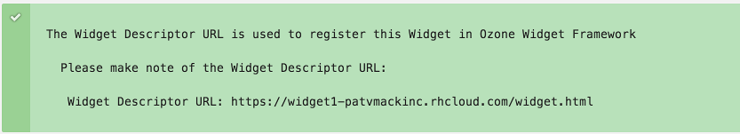

##Step 3: Configure the OWF desktop (optional)
\* This step is optional, but recommended.  OWF comes out of the box with a tabbed layout, which can be a little difficult to use.  Re-configuring it to use the "Desktop" layout makes things a little easier.

* Using a browser, log into the OWF desktop (the application deployed in Step 1)
    * username is jimi, password is password

* Click the "Switcher" button 

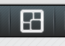

* Click "Manage" 

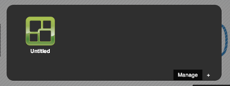

* Click "Edit" on the current desktop 

* Click "OK" 

* Select the "Desktop" layout icon and drag it to workspace on the left 

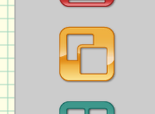

* Once set, click "Save"

##Step 4: Register the first widget
\* "Registering" the Widget just gives the Framework a little information about 
it (URL, icons, name, etc...).  The "Widget Descriptor" (URL should be in your paste buffer from Step 2) is an HTML file that contains the Widget's information so the admin doesn't need to input it.  Creating this file is something the Widget Cartridge does for you.

* While logged into the OWF desktop, click "Administration"

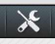

* Click "Widgets" in the Admin tools

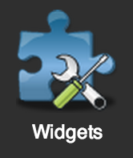

* Click "Create" in the Widgets window

* Paste the Descriptor URL from Step 2 into the "Import Widget from Descriptor URL" box

* Click "Load" then "Apply"

\* After clicking "Apply" the "Users" and "Groups" button become available

* Click the "Groups" button, then "Add" and give both groups access to the widget (Administrators and Users)

\* The widget is now registered, close all the administration windows that are open.

###Step 4.1: Launch the first widget

* Click the "Launcher" button

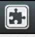

\* in the launcher you will see your new Widget, Hooray!!  Double click the widget icon and you'll see a slightly modified version of the standard OpenShift Tomcat Cartridge template application.

\* The difference in the Widget Cartridge template is that is has the OWF JavaScript API bundled.  In the application there are two sections that exercise the JavaScript API.  However, the big deal about Ozone is the ability for Widgets to communicate with each other using a process called "Inter-Widget Communication".  This gives the widgets the ability to control other widgets, pass data to other widgets, and receive instructions and data from other Widgets.

\* If you've seen the standard OpenShift Tomcat cartridge demonstration, this may be a good time to re-visit some of those core principles of OpenShift.  You may want to clone the repository for the Widget, make a small change, and push the changes.  Then reload the frame in OWF containing your widget and show the live result of the change.

\* But, we only have one Widget.  So we'll remedy that by spinning up another Widget.

##Step 5: Deploy the Second Widget

* Repeat Step 2 using a different name for this Widget

* Repeat Step 4 to register the Second Widget

##Step 6: Exercise Ozone "Intents"
\* Ozone "Intents" are a form of "Inter-Widget Communication" supported by the Ozone Framework.
When registered (see Step 4), Widgets can assert that they send and receive "Intents".  Intents are basically a data payload delivered over a named channel.  When a Widget broadcasts a payload using the Intent API, the framework will discover all other Widgets that can receive the payload and ask the user which Widget should be used to satisfy the Intent.

\* A full tutorial on the Ozone API is outside the scope of this walkthrough.  But you can find plenty of resources on the internet to make full use of the API to provide a rich application experience.

\* The Ozone Widget Cartridge provides a simple "Hello World" example to get developers started

*  The First Widget should still be up (if it isn't, repeat Step 4.1)

*  In the First Widget, scroll the "Intents" demo section and click "Send Hello Intent"

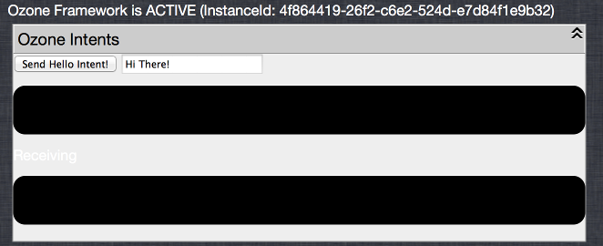

*  The framework will present you with options to choose the Widget that should be used to handle the intent and data payload.  You may choose a Widget that is already running, or to launch a new Widget to handle the data.  In this case, choose to launch a new instance of your Second Widget.

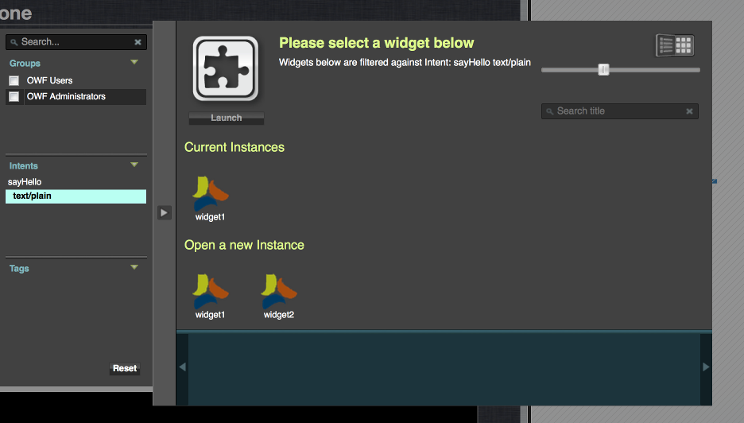

*  Once the Second Widget is launched, it will receive and handle the data payload delivered with the Intent.

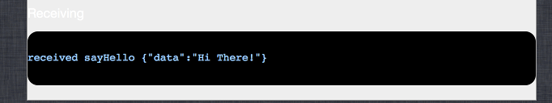

##Step 7: Exercise Ozone "Inter-Widget Communication"
\* Inter-Widget Communication is a more traditional publish/subscribe mechanism.
Widgets can "Shout" and "Listen" to named "Channels".  Any time a message or payload is "shouted" on a channel, and Widget that is "listening" will receive the message.

\*  Similar to the Intents exercise in Step 6, Inter-Widget Communication is demonstrated between the First and Second Widgets using the "Publish Hello Message" button

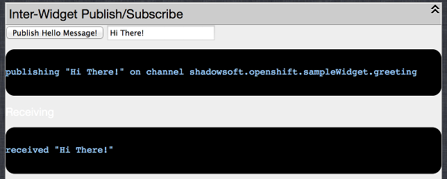 

##Some closing thoughts.
\* If we step back and look at what we've done through the course of this walkthrough, it's actually pretty amazing.  Using the OpenShift PaaS, we deployed the Ozone Widget Framework, two working Widgets, and are able to start developing capability within a matter of minutes.

* There are a few significant things here.
    *  the speed at which we are able to reach a point where we are productively building a Widget
    *  that we were able to extend the OpenShift PaaS itself by adding a cartridge that has a more domain specific framework (Ozone for the DoD).
    *  use of a centralized CM repository and a common PaaS platform to provide a consistent environment across the SDLC
  
